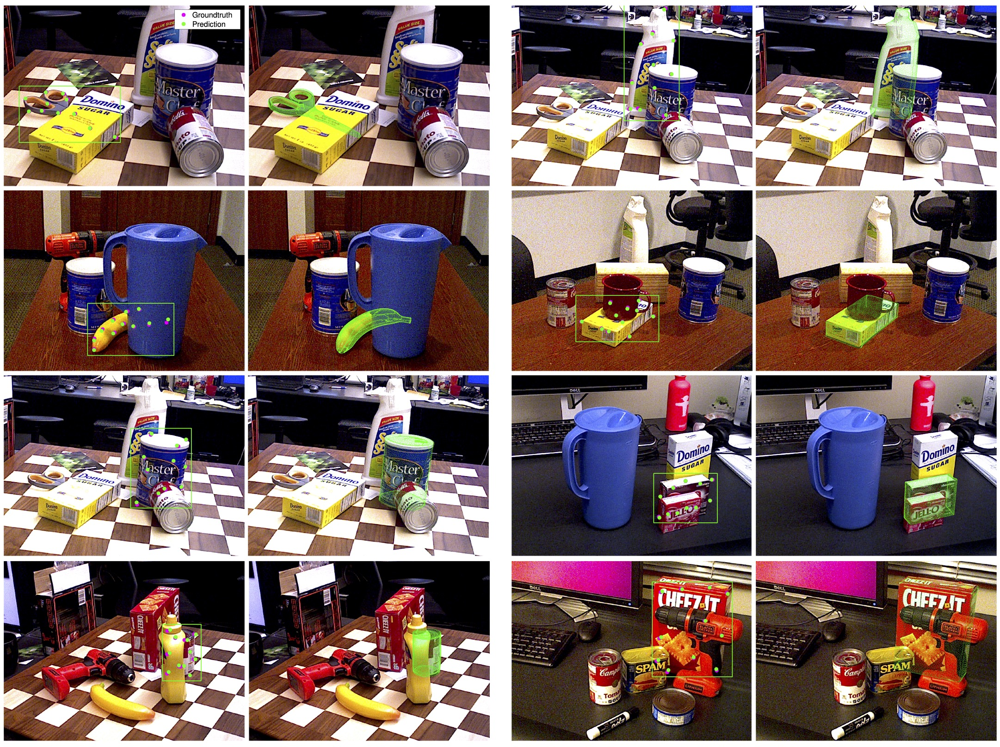

# Robust Object Pose Estimation (ROPE)
This repo stores code used in the paper
## [Occlusion-Robust Object Pose Estimation with Holistic Representation](https://openaccess.thecvf.com/content/WACV2022/papers/Chen_Occlusion-Robust_Object_Pose_Estimation_With_Holistic_Representation_WACV_2022_paper.pdf)



### Environment
Our system environment is provided in environment.yaml for consideration.

### Datasets
The Linemod (lm), Linemod-Occluded (lmo) and YCB-Video (ycbv) datasets can be downloaded from the [BOP](https://bop.felk.cvut.cz/datasets/) website. The paths to the datasets should then be specified in the cfg.yaml file. 

For better initialisation, the pretrained hrnet backbone file can be downloaded from [here](https://github.com/leoxiaobin/deep-high-resolution-net.pytorch).

### Usage examples
To train for the lm test set in distrubted mode
````bash
python -m torch.distributed.launch --nproc_per_node=<num_gpus_to_use> --use_env main_lm.py --cfg cfg.yaml --obj duck --log_name <name_this_experiment>
````

To train for the lmo test set in single GPU mode
````bash
CUDA_VISIBLE_DEVICES=<which_gpu> python main_lmo.py --cfg cfg.yaml --obj ape --log_name <name_this_experiment> 
````

To load trained model and test on the lmo dataset
````bash
CUDA_VISIBLE_DEVICES=<which_gpu> python main_lmo.py --cfg cfg.yaml --obj cat --log_name <which_experiment_to_load> --resume --test-only 
````


To train for the ycbv test set for object 01
````bash
python -m torch.distributed.launch --nproc_per_node=<num_gpus_to_use> --use_env main_ycbv.py --cfg cfg.yaml --obj 01 --log_name <name_this_experiment>
````

To compute AUC for a ycbv test result for object 20
````bash
python analysis.py --cfg cfg.yaml --log_name <which_experiment_to_load> --obj 20
````

### Cite this work
````
@inproceedings{chen2022occlusion,
    Author = {Chen, Bo and Chin, Tat-Jun and Klimavicius, Marius},
    Title = {Occlusion-Robust Object Pose Estimation with Holistic Representation},
    Booktitle = {WACV},
    Year = {2022}
}
````

